# Domain model

This is the design produced **before** writing the domain code, per the assignment's
UML requirement. It is a living document — update it whenever the design changes, and
keep the final version in sync with the shipped code.

The authoritative, editable diagram is [`domain-model.drawio`](./domain-model.drawio)
(open it at [diagrams.net](https://app.diagrams.net) / the draw.io desktop app, or edit
the XML directly). The Mermaid rendering below is a read-only preview of the same
design for quick viewing in GitHub/editors that don't have draw.io installed.

## Preview

```mermaid
classDiagram
    class ICombatant {
        <<interface>>
        +string Name
        +int CurrentHitPoints
        +int MaxHitPoints
        +bool IsDefeated
        +TakeDamage(amount) void
    }

    class Adventurer {
        <<abstract>>
        -int _mana
        +int Mana
        +SpendMana(amount) void
        +RestoreMana(amount) void
        +UseSignatureMove(target)* string
    }
    ICombatant <|.. Adventurer
    Adventurer <|-- Warrior
    Adventurer <|-- Mage
    Adventurer <|-- Healer
    Adventurer <|-- Ranger

    class Monster {
        <<abstract>>
        +PerformAttack(target)* string
    }
    ICombatant <|.. Monster
    Monster <|-- Slime
    Monster <|-- Goblin
    Monster <|-- Dragon

    class ISpellcaster { <<interface>> +CastSpell(target) string }
    class IHealer { <<interface>> +Heal(target) string }
    class IPhysicalAttacker { <<interface>> +PerformMeleeAttack(target) string }
    class IDefender { <<interface>> +Guard() string }
    class IFleeable { <<interface>> +AttemptFlee() bool }
    ISpellcaster <|.. Mage
    IHealer <|.. Healer
    IPhysicalAttacker <|.. Warrior
    IPhysicalAttacker <|.. Goblin
    IDefender <|.. Warrior
    IFleeable <|.. Ranger

    class Severity { <<enumeration>> Low Medium High }
    class Encounter {
        +string Description
        +string Location
        +Severity Severity
        +bool IsResolved
        +Resolve() void
    }
    Encounter --> Severity
    Encounter --> Monster : features

    class IChampionSelectionStrategy { <<interface>> +SelectChampion(encounter, adventurers) Adventurer }
    class FirstAvailableChampionStrategy
    IChampionSelectionStrategy <|.. FirstAvailableChampionStrategy

    class IParty {
        <<interface>>
        +Register(adventurer) void
        +RespondTo(encounter) Adventurer
        +ResolveEncounter(encounter, onResolved) void
    }
    class Party
    IParty <|.. Party
    Party o-- Adventurer : roster
    Party *-- Encounter : encounter log
    Party ..> IChampionSelectionStrategy : uses

    class AdventurerUnavailableException
    class NoSuitableAdventurerFoundException
    class InsufficientManaException

    class DomainToolbox { <<static>> +FindFirst~T~(items, predicate) T }

    class IItem { <<interface>> +string Name +Describe() string }
    class IUsable { <<interface>> +Use(target) void }
    class IEquippable { <<interface>> +EquipmentSlot Slot }
    IItem <|-- IUsable
    IItem <|-- IEquippable
    IUsable <|.. HealingPotion
    IEquippable <|.. Sword

    class IEncounterGenerator { <<interface>> +Generate(location) Encounter }
    class IBattleResolver { <<interface>> +Resolve(party, encounter) BattleOutcome }
    class BattleOutcome { <<enumeration>> Victory Fled Defeat }
    IBattleResolver --> BattleOutcome
```

## Reskin note

This started life as the assignment's "superhero dispatch center" brief. The case is
reskinned as an old-school Dragon-Quest-style game (party exploring an overworld,
random monster encounters) while keeping the same graded requirements underneath:
`Hero` → `Adventurer`, `Incident` → `Encounter`, `DispatchCenter` → `Party`,
`IDispatchStrategy` → `IChampionSelectionStrategy`.

## Design rationale

**`ICombatant` as the shared contract.** Both `Adventurer` and `Monster` implement
it so any battle-resolution code can operate on "a thing that can fight" without
caring which side of the encounter it belongs to. This is why it's an interface and
not a shared base class: adventurers and monsters have nothing in common
*structurally* (an adventurer has mana and a signature move; a monster has an attack
pattern) — they only share a *capability*, which is exactly what an interface is for.

**Ability interfaces independent of the class hierarchy.** `ISpellcaster`,
`IHealer`, `IPhysicalAttacker`, `IDefender`, `IFleeable` each represent one battle
command a DQ-style game supports. They're deliberately not baked into `Adventurer`
itself, because not every adventurer (or monster — see `Goblin` implementing
`IPhysicalAttacker`) has every ability, and which abilities exist should be able to
grow without touching the `Adventurer`/`Monster` base classes.

**Aggregation vs. composition on `Party`.** The roster (`List<Adventurer>`) is an
*aggregation* — an adventurer can be registered, benched, or removed without the
`Party` object owning its lifecycle; the adventurer object is meaningful on its own.
The encounter log (`List<Encounter>`) is a *composition* — an `Encounter` only
exists as an entry in some party's history; nothing else in the domain creates or
holds one independently, and it has no meaning detached from the log it belongs to.

**Why most consumable types are interfaces, not concrete classes.** Per the stated
project preference, code that *uses* a capability (e.g. resolving a battle, spending
an item) should depend on the interface (`ICombatant`, `IUsable`, `IChampionSelectionStrategy`,
`IParty`, `IBattleResolver`, `IEncounterGenerator`), never on a concrete type like
`Party` or `FirstAvailableChampionStrategy` directly. This is what makes
`IChampionSelectionStrategy` swappable (kernekrav h / dependency inversion) without
touching `Party`, and what will let `IBattleResolver` grow from a trivial
auto-resolver into a full interactive battle screen later without changing anything
that depends on the interface.

**Access modifiers.** Default to the most restrictive option that still works:
leaf classes (`Warrior`, `Slime`, `FirstAvailableChampionStrategy`, exception types,
…) are `sealed` since nothing is designed to derive further from them. Mutating
state (`Adventurer.Mana`, `IsKnockedOut`/`IsDefeated`, `Encounter.IsResolved`) is
exposed as a public getter with a `private` (or `internal`, where the owning
manager class needs to set it) setter — encapsulation isn't just "make fields
private", it's "only the code that's supposed to change this state can change it".
Widened only when an actual consumer needs it.

## Status

Implemented so far: see [`../PROGRESS.md`](../PROGRESS.md) for the up-to-date
checklist — this file only tracks the *design*, not build status.
