# Domain model

The domain as built in `src/Dqh.Domain` — combat core, a full turn-based
battle loop, plus party/encounter management (kernekrav a–h). See
[`../PROGRESS.md`](../PROGRESS.md) for what's next (items, wiring the
innkeeper's heal in `Dqh.Game`).

```mermaid
classDiagram
    class ICombatant {
        <<interface>>
        +string Name
        +int MaxHitPoints
        +int CurrentHitPoints
        +bool IsDefeated
        +int Speed
        +TakeDamage(amount) void
        +Heal(amount) void
    }
    class HitPointTrack {
        <<internal>>
        +int MaxHitPoints
        +int Current
        +bool IsDefeated
        +TakeDamage(amount) void
        +Heal(amount) void
    }

    class Adventurer {
        <<abstract>>
        -int _mana
        +int Mana
        +bool IsGuarding
        +CanAfford(manaCost) bool
        +SpendMana(amount) void
        +RestoreMana(amount) void
        +FullyRestore() void
        +ResetGuard() void
        +TakeTurn(target) string
        +PerformTurnAction(target)* string
    }
    Adventurer ..|> ICombatant
    Adventurer *-- HitPointTrack : hit points
    Adventurer <|-- Hero
    Adventurer <|-- Warrior
    Adventurer <|-- Mage
    Adventurer <|-- Priest
    Adventurer <|-- Ranger

    class IAttacker { <<interface>> +PerformAttack(target) string }
    class ISpellcaster { <<interface>> +KnownSpells +Cast(spell, target) string }
    class IHealer { <<interface>> +KnownHealingSpells +Heal(spell, target) string }
    class IDefender { <<interface>> +Guard() string }
    class IFleeable { <<interface>> +AttemptFlee() bool }

    Hero ..|> IAttacker
    Warrior ..|> IAttacker
    Warrior ..|> IDefender
    Mage ..|> IAttacker
    Mage ..|> ISpellcaster
    Priest ..|> IAttacker
    Priest ..|> IHealer
    Ranger ..|> IAttacker
    Ranger ..|> IFleeable

    class IMonster {
        <<interface>>
        +MonsterKind Kind
        +int AttackPower
        +int DefensePower
        +IsWeakTo(element) bool
    }
    IMonster --|> ICombatant

    class MonsterKind { <<enumeration>> Slime=1 Dracky=2 Ghost=3 MetalSlime=4 }
    class MonsterDefinition {
        +MonsterKind Kind
        +string Name
        +int MaxHitPoints
        +int AttackPower
        +int DefensePower
        +ElementType AttackElement
        +Weaknesses
        +string AttackDescriptionTemplate
        +int AttackWeight
        +int FleeWeight
        +int Speed
    }
    class MonsterBestiary { <<internal, static>> +Get(kind) MonsterDefinition }
    class Monster {
        +Create(kind, targetSelectionStrategy)$ Monster
        +PerformAttack(target) string
        +AttemptFlee() bool
        +ChooseTarget(availableTargets) Adventurer
        +IsWeakTo(element) bool
    }

    Monster ..|> IMonster
    Monster ..|> IAttacker
    Monster ..|> IFleeable
    Monster *-- HitPointTrack : hit points
    Monster o-- MonsterDefinition : stats
    Monster ..> MonsterBestiary : Create() looks up
    Monster ..> ITargetSelectionStrategy : uses
    MonsterBestiary *-- MonsterDefinition : catalog
    MonsterBestiary ..> MonsterKind : keyed by

    class ElementType { <<enumeration>> Physical=1 Fire=2 Ice=3 Wind=4 Explosion=5 }
    class ISpell { <<interface>> +string Name +int ManaCost +Apply(caster, target) string }
    class DamageSpell { +ElementType Element +Apply(caster, target) string }
    class HealingSpell { +Apply(caster, target) string }
    class SpellId { <<enumeration>> Ember=1 Inferno=2 Mend=3 GreaterMend=4 }
    class SpellBook { <<internal, static>> +GetDamageSpell(id) DamageSpell +GetHealingSpell(id) HealingSpell }

    DamageSpell ..|> ISpell
    HealingSpell ..|> ISpell
    DamageSpell ..> IMonster : checks weakness
    SpellBook *-- DamageSpell : catalog
    SpellBook *-- HealingSpell : catalog
    SpellBook ..> SpellId : keyed by
    Mage o-- DamageSpell : known spells
    Mage ..> SpellBook : looks up
    Priest o-- HealingSpell : known spells
    Priest ..> SpellBook : looks up

    class Encounter {
        +Monsters
        +bool IsResolved
    }
    Encounter o-- IMonster : monster group

    class IEncounterGenerator { <<interface>> +Generate() Encounter }
    class RandomEncounterGenerator { +Generate() Encounter }
    RandomEncounterGenerator ..|> IEncounterGenerator
    RandomEncounterGenerator ..> Monster : Create(kind, strategy)
    RandomEncounterGenerator o-- ITargetSelectionStrategy : injected, passed to each Monster

    class BattleCommand { <<abstract>> +Adventurer Actor }
    class AttackCommand { +IMonster Target }
    class CastCommand { +DamageSpell Spell +IMonster Target }
    class HealCommand { +HealingSpell Spell +Adventurer Target }
    class GuardCommand
    class FleeCommand
    BattleCommand <|-- AttackCommand
    BattleCommand <|-- CastCommand
    BattleCommand <|-- HealCommand
    BattleCommand <|-- GuardCommand
    BattleCommand <|-- FleeCommand

    class BattleRoundResult { +Log +FledMonsters +bool PartyFled }
    class IBattleResolver { <<interface>> +ResolveRound(party, monsters, commands) BattleRoundResult }
    class StandardBattleResolver { +ResolveRound(party, monsters, commands) BattleRoundResult }
    StandardBattleResolver ..|> IBattleResolver
    StandardBattleResolver ..> BattleCommand : dispatches by type
    StandardBattleResolver ..> BattleRoundResult : returns
    StandardBattleResolver ..> IMonster : ChooseTarget / AttemptFlee / PerformAttack

    class ITargetSelectionStrategy { <<interface>> +SelectTarget(attacker, availableTargets) Adventurer }
    class RandomTargetStrategy { +SelectTarget(attacker, availableTargets) Adventurer }
    RandomTargetStrategy ..|> ITargetSelectionStrategy

    class IParty {
        <<interface>>
        +Members IReadOnlyList~Adventurer~
        +Register(adventurer) void
        +Report(encounter) void
        +ResolveEncounter(encounter, onResolved) void
        +FindAvailableHealer() Adventurer
        +FindFirstUnresolvedEncounter() Encounter
    }
    class Party {
        +Members IReadOnlyList~Adventurer~
        +Register(adventurer) void
        +Report(encounter) void
        +ResolveEncounter(encounter, onResolved) void
    }
    Party ..|> IParty
    Party o-- Adventurer : roster
    Party *-- Encounter : encounter log
    Party ..> DomainToolbox : uses

    class DomainToolbox { <<static>> +FindFirst~T~(items, predicate) T }

    class UnknownSpellException
    class AdventurerAlreadyRegisteredException
    Exception <|-- UnknownSpellException
    Exception <|-- AdventurerAlreadyRegisteredException
```

**Reskin:** the brief's superhero dispatch case, renamed — `Hero`→`Adventurer`,
`Incident`→`Encounter`, `DispatchCenter`→`Party`.

## Why it's shaped this way

- **`ICombatant` interface, no shared base class.** `Adventurer` and `Monster` only
  share HP bookkeeping (composed via `HitPointTrack`, not inherited) — everything
  else diverges. Shared *capability*, not shared *taxonomy*: a Duck and an Airplane
  both `CanFly` without a common `Flyer` base.
- **Monsters are one data-driven class, not a subclass per monster.**
  `MonsterKind` → `MonsterDefinition` → `MonsterBestiary` → single `Monster` class.
  Same pattern for spells (`ISpell` + `DamageSpell`/`HealingSpell`, no abstract
  `Spell` base) via `SpellId` → `SpellBook`.
- **Every adventurer can attack; some also have a special ability.** `IAttacker` is
  on all five concrete types (everyone can throw a basic hit), while
  `ISpellcaster`/`IHealer`/`IDefender`/`IFleeable` are each exclusive to one —
  matching a DQ battle menu (Attack is always available; Spell/Defend/Run aren't
  universal here). `IAttacker` and `IFleeable` are also implemented by the
  unrelated `Monster` class — ability, not position in a type tree.
- **A monster's attack-vs-flee choice is weighted data, not a strategy class.**
  `MonsterDefinition.AttackWeight`/`FleeWeight` drive `Monster.AttemptFlee()`'s
  roll — regular monsters always attack (100/0); `MetalSlime` mostly flees
  (10/90), matching its real reputation. This is how the original games actually
  stored monster behavior (a per-species weight table), not object polymorphism.
- **The injected strategy lives on the attacker, not the target.** Which living
  party member a monster's attack lands on is the monster's decision to make —
  the same category of choice as `AttemptFlee()`'s attack/flee weights, just
  swappable instead of data-driven, since a real second implementation
  (front-biased, lowest-HP, ...) is worth having here. `Monster` takes an
  `ITargetSelectionStrategy` at construction (dependency inversion, kernekrav h)
  and exposes `ChooseTarget(availableTargets)`; `RandomEncounterGenerator` is
  where it's actually injected (constructor param, passed to every `Monster.Create`
  it calls), first implementation `RandomTargetStrategy`. This replaced an
  earlier version where `Party` held the strategy and answered
  `ChooseTarget(attacker)` on the monster's behalf — technically working, but
  backwards: `Party` doesn't decide who a monster attacks, the monster does, and
  the "party formation" framing that justified it wasn't an actual mechanic in
  the game, just a rationalization for parking kernekrav h's required strategy
  somewhere. Also fixes a precedent inconsistency: monster behavior everywhere
  else (`AttackWeight`/`FleeWeight`) already lives on the monster side, not the
  thing it acts on.
- **Speed decides turn order; Guard actually reduces damage.** Neither existed
  until the battle loop needed them — a fixed party-then-monster order and a
  flavor-only `Guard()` would've been the cheaper Domain change, but an
  authentic DQ round interleaves fast and slow actors, and Defend is supposed
  to matter. `ICombatant.Speed` sorts a round's actors descending (Ranger and
  MetalSlime fastest, matching their DQ reputations); `Adventurer.IsGuarding`
  (set by `Warrior.Guard()`, cleared by `ResetGuard()` at the start of the next
  round) halves the next hit inside `Adventurer.TakeDamage` itself — no caller
  needs to know guarding exists to still benefit from it.
- **`IBattleResolver`/`StandardBattleResolver`: orchestration over old parts,
  not new mechanics.** `ResolveRound` merges a round's `BattleCommand`s (one
  per living party member) with every living monster into one Speed-ordered
  list and executes each turn by dispatching to the exact ability interface a
  `BattleCommand` needs (`AttackCommand`→`IAttacker`, `CastCommand`→
  `ISpellcaster`, ...) — every action still returns the same flavor-text
  string `PerformAttack`/`Cast`/`Heal`/`Guard` always did, just collected into
  `BattleRoundResult.Log` instead of handed back one call at a time. A
  monster's own turn still rolls `AttemptFlee()` against
  `AttackWeight`/`FleeWeight` and, if it doesn't flee, still calls
  `Monster.ChooseTarget` then `PerformAttack` — nothing about *how* a monster
  decides to act changed, only that something now actually calls it every
  round. A fled monster is reported in `BattleRoundResult.FledMonsters`
  rather than removed by the resolver itself, keeping it a stateless,
  swappable service — the caller owns the encounter's active roster.
- **`IEncounterGenerator` mirrors `ITargetSelectionStrategy`'s shape.**
  Another small injected-strategy interface (kernekrav h already has its one
  required example in `ITargetSelectionStrategy`; this is additive
  consistency, not a second requirement) — `RandomEncounterGenerator` builds
  a group of 1-3 monsters from the whole bestiary via the existing
  `Monster.Create`, swappable for a different generation policy later without
  touching whatever calls it. It's also now `ITargetSelectionStrategy`'s actual
  injection point (see above) — it holds the strategy and hands it to every
  `Monster` it creates, so every monster from a given generator shares one
  targeting policy without `Monster.Create`'s other 27 call sites (mostly
  tests with no interest in targeting) needing to supply one; the factory
  falls back to `RandomTargetStrategy` when none is given.
- **Exceptions are for caller mistakes, not expected game states.** A party wipe,
  running low on mana, or a defeated adventurer trying to act are normal outcomes
  of play — `ChooseTarget` returns `null`, `Cast`/`Heal` return a message, instead
  of throwing. `UnknownSpellException` (casting a spell you don't know) and
  `AdventurerAlreadyRegisteredException` (registering the same adventurer twice)
  only happen from an actual bug in the calling code, which is what an exception
  should mean.
- **Aggregation vs. composition, applied literally.** Catalogs (`MonsterBestiary`,
  `SpellBook`) *compose* their entries — they own them. `Monster`/`Mage`/`Priest`/
  `Party`'s roster only *aggregate* — many share the same catalog entry, or exist
  independently of the party. `Party`'s encounter log and each combatant's
  `HitPointTrack` are genuinely composed (owned exclusively, die with their owner).
- **`FullyRestore()` and `Members` exist for the Inn.** `Dqh.Game`'s innkeeper NPC
  needs to heal HP and mana back to full for every registered adventurer — a real
  DQ inn mechanic, not a domain-internal need. `FullyRestore()` delegates to the
  existing `Heal`/`RestoreMana` (capped at max, no overflow risk from passing
  `int.MaxValue`); `Members` is a read-only view added because the roster
  previously only supported single-item predicate lookups, and "heal everyone"
  needs to enumerate it.
- **Access modifiers, restrictive by default.** Leaf classes `sealed`; internal
  helpers (`HitPointTrack`, `MonsterBestiary`, `SpellBook`) `internal`; mutable
  state is a public getter behind a `private` setter, changed only via validated
  methods. Enums use explicit 1-based values so reordering can't renumber them.

See [`../PROGRESS.md`](../PROGRESS.md) for build status.
