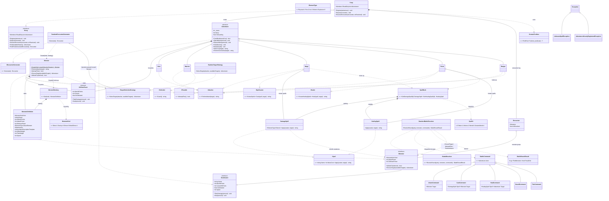

```mermaid
classDiagram
    class ICombatant {
        <<interface>>
        +string Name
        +int MaxHitPoints
        +int CurrentHitPoints
        +bool IsDefeated
        +int Speed
        +TakeDamage(amount) void
        +Heal(amount) void
    }
    class HitPointTrack {
        <<internal>>
        +int MaxHitPoints
        +int Current
        +bool IsDefeated
        +TakeDamage(amount) void
        +Heal(amount) void
    }

    class Adventurer {
        <<abstract>>
        -int _mana
        +int Mana
        +bool IsGuarding
        +CanAfford(manaCost) bool
        +SpendMana(amount) void
        +RestoreMana(amount) void
        +FullyRestore() void
        +ResetGuard() void
        +TakeTurn(target) string
        +PerformTurnAction(target)* string
    }
    Adventurer ..|> ICombatant
    Adventurer *-- HitPointTrack : hit points
    Adventurer <|-- Hero
    Adventurer <|-- Warrior
    Adventurer <|-- Mage
    Adventurer <|-- Priest
    Adventurer <|-- Ranger

    class IAttacker { <<interface>> +PerformAttack(target) string }
    class ISpellcaster { <<interface>> +KnownSpells +Cast(spell, target) string }
    class IHealer { <<interface>> +KnownHealingSpells +Heal(spell, target) string }
    class IDefender { <<interface>> +Guard() string }
    class IFleeable { <<interface>> +AttemptFlee() bool }

    Hero ..|> IAttacker
    Warrior ..|> IAttacker
    Warrior ..|> IDefender
    Mage ..|> IAttacker
    Mage ..|> ISpellcaster
    Priest ..|> IAttacker
    Priest ..|> IHealer
    Ranger ..|> IAttacker
    Ranger ..|> IFleeable

    class IMonster {
        <<interface>>
        +MonsterKind Kind
        +int AttackPower
        +int DefensePower
        +IsWeakTo(element) bool
        +ChooseTarget(availableTargets) Adventurer
    }
    IMonster --|> ICombatant

    class MonsterKind { <<enumeration>> Slime=1 Dracky=2 Ghost=3 MetalSlime=4 }
    class MonsterDefinition {
        +MonsterKind Kind
        +string Name
        +int MaxHitPoints
        +int AttackPower
        +int DefensePower
        +ElementType AttackElement
        +Weaknesses
        +string AttackDescriptionTemplate
        +int AttackWeight
        +int FleeWeight
        +int Speed
    }
    class MonsterBestiary { <<internal, static>> +Get(kind) MonsterDefinition }
    class Monster {
        +Create(kind, targetSelectionStrategy)$ Monster
        +PerformAttack(target) string
        +AttemptFlee() bool
        +ChooseTarget(availableTargets) Adventurer
        +IsWeakTo(element) bool
    }

    Monster ..|> IMonster
    Monster ..|> IAttacker
    Monster ..|> IFleeable
    Monster *-- HitPointTrack : hit points
    Monster o-- MonsterDefinition : stats
    Monster ..> MonsterBestiary : Create() looks up
    Monster ..> ITargetSelectionStrategy : uses
    MonsterBestiary *-- MonsterDefinition : catalog
    MonsterBestiary ..> MonsterKind : keyed by

    class ElementType { <<enumeration>> Physical=1 Fire=2 Ice=3 Wind=4 Explosion=5 }
    class ISpell { <<interface>> +string Name +int ManaCost +Apply(caster, target) string }
    class DamageSpell { +ElementType Element +Apply(caster, target) string }
    class HealingSpell { +Apply(caster, target) string }
    class SpellId { <<enumeration>> Ember=1 Inferno=2 Mend=3 GreaterMend=4 }
    class SpellBook { <<internal, static>> +GetDamageSpell(id) DamageSpell +GetHealingSpell(id) HealingSpell }

    DamageSpell ..|> ISpell
    HealingSpell ..|> ISpell
    DamageSpell ..> IMonster : checks weakness
    SpellBook *-- DamageSpell : catalog
    SpellBook *-- HealingSpell : catalog
    SpellBook ..> SpellId : keyed by
    Mage o-- DamageSpell : known spells
    Mage ..> SpellBook : looks up
    Priest o-- HealingSpell : known spells
    Priest ..> SpellBook : looks up

    class Encounter {
        +Monsters
        +bool IsResolved
    }
    Encounter o-- IMonster : monster group

    class IEncounterGenerator { <<interface>> +Generate() Encounter }
    class RandomEncounterGenerator { +Generate() Encounter }
    RandomEncounterGenerator ..|> IEncounterGenerator
    RandomEncounterGenerator ..> Monster : Create(kind, strategy)
    RandomEncounterGenerator o-- ITargetSelectionStrategy : injected, passed to each Monster

    class BattleCommand { <<abstract>> +Adventurer Actor }
    class AttackCommand { +IMonster Target }
    class CastCommand { +DamageSpell Spell +IMonster Target }
    class HealCommand { +HealingSpell Spell +Adventurer Target }
    class GuardCommand
    class FleeCommand
    BattleCommand <|-- AttackCommand
    BattleCommand <|-- CastCommand
    BattleCommand <|-- HealCommand
    BattleCommand <|-- GuardCommand
    BattleCommand <|-- FleeCommand

    class BattleRoundResult { +Log +FledMonsters +bool PartyFled }
    class IBattleResolver { <<interface>> +ResolveRound(party, monsters, commands) BattleRoundResult }
    class StandardBattleResolver { +ResolveRound(party, monsters, commands) BattleRoundResult }
    StandardBattleResolver ..|> IBattleResolver
    StandardBattleResolver ..> BattleCommand : dispatches by type
    StandardBattleResolver ..> BattleRoundResult : returns
    StandardBattleResolver ..> IMonster : ChooseTarget / AttemptFlee / PerformAttack

    class ITargetSelectionStrategy { <<interface>> +SelectTarget(attacker, availableTargets) Adventurer }
    class RandomTargetStrategy { +SelectTarget(attacker, availableTargets) Adventurer }
    RandomTargetStrategy ..|> ITargetSelectionStrategy

    class IParty {
        <<interface>>
        +Members IReadOnlyList~Adventurer~
        +Register(adventurer) void
        +Report(encounter) void
        +ResolveEncounter(encounter, onResolved) void
        +FindAvailableHealer() Adventurer
        +FindFirstUnresolvedEncounter() Encounter
    }
    class Party {
        +Members IReadOnlyList~Adventurer~
        +Register(adventurer) void
        +Report(encounter) void
        +ResolveEncounter(encounter, onResolved) void
    }
    Party ..|> IParty
    Party o-- Adventurer : roster
    Party *-- Encounter : encounter log
    Party ..> DomainToolbox : uses

    class DomainToolbox { <<static>> +FindFirst~T~(items, predicate) T }

    class UnknownSpellException
    class AdventurerAlreadyRegisteredException
    Exception <|-- UnknownSpellException
    Exception <|-- AdventurerAlreadyRegisteredException
```
