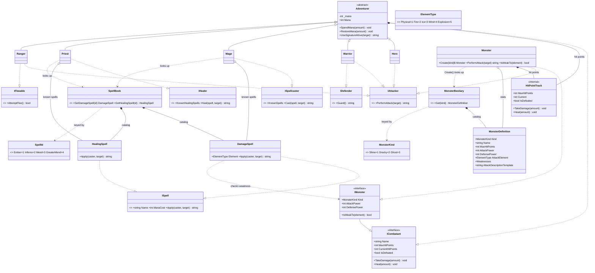

# Domain model

The combat core as built in `src/Dqh.Domain` (kernekrav a/b). `Encounter`/`Party`/
strategy/exceptions/etc. (kernekrav c–h) aren't built yet — see
[`../PROGRESS.md`](../PROGRESS.md) for what's next.

**Reskin:** the brief's superhero dispatch case, renamed — `Hero`→`Adventurer`,
`Incident`→`Encounter` (not built yet), `DispatchCenter`→`Party` (not built yet).

## Why it's shaped this way

- **`ICombatant` interface, no shared base class.** `Adventurer` and `Monster` only
  share HP bookkeeping (composed via `HitPointTrack`, not inherited) — everything
  else diverges. Shared *capability*, not shared *taxonomy*: a Duck and an Airplane
  both `CanFly` without a common `Flyer` base.
- **Monsters are one data-driven class, not a subclass per monster.**
  `MonsterKind` → `MonsterDefinition` → `MonsterBestiary` → single `Monster` class.
  Same pattern for spells (`ISpell` + `DamageSpell`/`HealingSpell`, no abstract
  `Spell` base) via `SpellId` → `SpellBook`.
- **Aggregation vs. composition, applied literally.** Catalogs (`MonsterBestiary`,
  `SpellBook`) *compose* their entries — they own them. `Monster`/`Mage`/`Priest`
  only *aggregate* a shared entry looked up from a catalog — they don't own it
  exclusively. `HitPointTrack` is genuinely composed (private, dies with its owner).
- **Ability interfaces cut across the hierarchy.** `IAttacker` is implemented by
  three `Adventurer` subclasses *and* the unrelated `Monster` — capability, not
  position in a type tree. `ISpellcaster`/`IHealer` are typed to their specific
  spell class, so the compiler blocks casting a heal spell through the attack path.
- **Elemental weaknesses are mechanical, not flavor.** `ElementType` mirrors DQ's
  spell families (Fire/Ice/Wind/Explosion + Physical). `DamageSpell.Apply` doubles
  damage when the target `IMonster` is weak to its element.
- **Access modifiers, restrictive by default.** Leaf classes `sealed`; internal
  helpers (`HitPointTrack`, `MonsterBestiary`, `SpellBook`) `internal`; mutable
  state is a public getter behind a `private` setter, changed only via validated
  methods. Enums use explicit 1-based values so reordering can't renumber them.

See [`../PROGRESS.md`](../PROGRESS.md) for build status.
