# Domain model

The domain as built in `src/Dqh.Domain` — combat core plus party/encounter
management (kernekrav a–h). See [`../PROGRESS.md`](../PROGRESS.md) for what's next
(items, encounter generation/battle resolution, wiring into `Dqh.Game`).

```mermaid
classDiagram
    class ICombatant {
        <<interface>>
        +string Name
        +int MaxHitPoints
        +int CurrentHitPoints
        +bool IsDefeated
        +TakeDamage(amount) void
        +Heal(amount) void
    }
    class HitPointTrack {
        <<internal>>
        +int MaxHitPoints
        +int Current
        +bool IsDefeated
        +TakeDamage(amount) void
        +Heal(amount) void
    }

    class Adventurer {
        <<abstract>>
        -int _mana
        +int Mana
        +CanAfford(manaCost) bool
        +SpendMana(amount) void
        +RestoreMana(amount) void
        +TakeTurn(target) string
        +PerformTurnAction(target)* string
    }
    Adventurer ..|> ICombatant
    Adventurer *-- HitPointTrack : hit points
    Adventurer <|-- Hero
    Adventurer <|-- Warrior
    Adventurer <|-- Mage
    Adventurer <|-- Priest
    Adventurer <|-- Ranger

    class IAttacker { <<interface>> +PerformAttack(target) string }
    class ISpellcaster { <<interface>> +KnownSpells +Cast(spell, target) string }
    class IHealer { <<interface>> +KnownHealingSpells +Heal(spell, target) string }
    class IDefender { <<interface>> +Guard() string }
    class IFleeable { <<interface>> +AttemptFlee() bool }

    Hero ..|> IAttacker
    Warrior ..|> IAttacker
    Warrior ..|> IDefender
    Mage ..|> IAttacker
    Mage ..|> ISpellcaster
    Priest ..|> IAttacker
    Priest ..|> IHealer
    Ranger ..|> IAttacker
    Ranger ..|> IFleeable

    class IMonster {
        <<interface>>
        +MonsterKind Kind
        +int AttackPower
        +int DefensePower
        +IsWeakTo(element) bool
    }
    IMonster --|> ICombatant

    class MonsterKind { <<enumeration>> Slime=1 Dracky=2 Ghost=3 MetalSlime=4 }
    class MonsterDefinition {
        +MonsterKind Kind
        +string Name
        +int MaxHitPoints
        +int AttackPower
        +int DefensePower
        +ElementType AttackElement
        +Weaknesses
        +string AttackDescriptionTemplate
        +int AttackWeight
        +int FleeWeight
    }
    class MonsterBestiary { <<internal, static>> +Get(kind) MonsterDefinition }
    class Monster {
        +Create(kind)$ Monster
        +PerformAttack(target) string
        +AttemptFlee() bool
        +IsWeakTo(element) bool
    }

    Monster ..|> IMonster
    Monster ..|> IAttacker
    Monster ..|> IFleeable
    Monster *-- HitPointTrack : hit points
    Monster o-- MonsterDefinition : stats
    Monster ..> MonsterBestiary : Create() looks up
    MonsterBestiary *-- MonsterDefinition : catalog
    MonsterBestiary ..> MonsterKind : keyed by

    class ElementType { <<enumeration>> Physical=1 Fire=2 Ice=3 Wind=4 Explosion=5 }
    class ISpell { <<interface>> +string Name +int ManaCost +Apply(caster, target) string }
    class DamageSpell { +ElementType Element +Apply(caster, target) string }
    class HealingSpell { +Apply(caster, target) string }
    class SpellId { <<enumeration>> Ember=1 Inferno=2 Mend=3 GreaterMend=4 }
    class SpellBook { <<internal, static>> +GetDamageSpell(id) DamageSpell +GetHealingSpell(id) HealingSpell }

    DamageSpell ..|> ISpell
    HealingSpell ..|> ISpell
    DamageSpell ..> IMonster : checks weakness
    SpellBook *-- DamageSpell : catalog
    SpellBook *-- HealingSpell : catalog
    SpellBook ..> SpellId : keyed by
    Mage o-- DamageSpell : known spells
    Mage ..> SpellBook : looks up
    Priest o-- HealingSpell : known spells
    Priest ..> SpellBook : looks up

    class Encounter {
        +Monsters
        +bool IsResolved
    }
    Encounter o-- IMonster : monster group

    class ITargetSelectionStrategy { <<interface>> +SelectTarget(attacker, availableTargets) Adventurer }
    class RandomTargetStrategy { +SelectTarget(attacker, availableTargets) Adventurer }
    RandomTargetStrategy ..|> ITargetSelectionStrategy

    class IParty {
        <<interface>>
        +Register(adventurer) void
        +Report(encounter) void
        +ChooseTarget(attacker) Adventurer
        +ResolveEncounter(encounter, onResolved) void
        +FindAvailableHealer() Adventurer
        +FindFirstUnresolvedEncounter() Encounter
    }
    class Party {
        +Register(adventurer) void
        +Report(encounter) void
        +ChooseTarget(attacker) Adventurer
        +ResolveEncounter(encounter, onResolved) void
    }
    Party ..|> IParty
    Party o-- Adventurer : roster
    Party *-- Encounter : encounter log
    Party ..> ITargetSelectionStrategy : uses
    Party ..> DomainToolbox : uses

    class DomainToolbox { <<static>> +FindFirst~T~(items, predicate) T }

    class UnknownSpellException
    class AdventurerAlreadyRegisteredException
    Exception <|-- UnknownSpellException
    Exception <|-- AdventurerAlreadyRegisteredException
```

**Reskin:** the brief's superhero dispatch case, renamed — `Hero`→`Adventurer`,
`Incident`→`Encounter`, `DispatchCenter`→`Party`.

## Why it's shaped this way

- **`ICombatant` interface, no shared base class.** `Adventurer` and `Monster` only
  share HP bookkeeping (composed via `HitPointTrack`, not inherited) — everything
  else diverges. Shared *capability*, not shared *taxonomy*: a Duck and an Airplane
  both `CanFly` without a common `Flyer` base.
- **Monsters are one data-driven class, not a subclass per monster.**
  `MonsterKind` → `MonsterDefinition` → `MonsterBestiary` → single `Monster` class.
  Same pattern for spells (`ISpell` + `DamageSpell`/`HealingSpell`, no abstract
  `Spell` base) via `SpellId` → `SpellBook`.
- **Every adventurer can attack; some also have a special ability.** `IAttacker` is
  on all five concrete types (everyone can throw a basic hit), while
  `ISpellcaster`/`IHealer`/`IDefender`/`IFleeable` are each exclusive to one —
  matching a DQ battle menu (Attack is always available; Spell/Defend/Run aren't
  universal here). `IAttacker` and `IFleeable` are also implemented by the
  unrelated `Monster` class — ability, not position in a type tree.
- **A monster's attack-vs-flee choice is weighted data, not a strategy class.**
  `MonsterDefinition.AttackWeight`/`FleeWeight` drive `Monster.AttemptFlee()`'s
  roll — regular monsters always attack (100/0); `MetalSlime` mostly flees
  (10/90), matching its real reputation. This is how the original games actually
  stored monster behavior (a per-species weight table), not object polymorphism.
- **The one injected strategy is party-side, not monster-side.** Which living
  party member a monster's attack lands on is genuinely swappable (front-biased,
  random, lowest-HP, ...) and belongs to the party's formation — `Party` takes an
  `ITargetSelectionStrategy` via its constructor (dependency inversion), first
  implementation `RandomTargetStrategy`.
- **Exceptions are for caller mistakes, not expected game states.** A party wipe,
  running low on mana, or a defeated adventurer trying to act are normal outcomes
  of play — `ChooseTarget` returns `null`, `Cast`/`Heal` return a message, instead
  of throwing. `UnknownSpellException` (casting a spell you don't know) and
  `AdventurerAlreadyRegisteredException` (registering the same adventurer twice)
  only happen from an actual bug in the calling code, which is what an exception
  should mean.
- **Aggregation vs. composition, applied literally.** Catalogs (`MonsterBestiary`,
  `SpellBook`) *compose* their entries — they own them. `Monster`/`Mage`/`Priest`/
  `Party`'s roster only *aggregate* — many share the same catalog entry, or exist
  independently of the party. `Party`'s encounter log and each combatant's
  `HitPointTrack` are genuinely composed (owned exclusively, die with their owner).
- **Access modifiers, restrictive by default.** Leaf classes `sealed`; internal
  helpers (`HitPointTrack`, `MonsterBestiary`, `SpellBook`) `internal`; mutable
  state is a public getter behind a `private` setter, changed only via validated
  methods. Enums use explicit 1-based values so reordering can't renumber them.

See [`../PROGRESS.md`](../PROGRESS.md) for build status.
